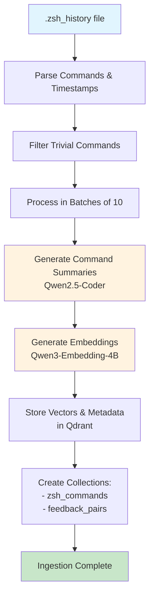
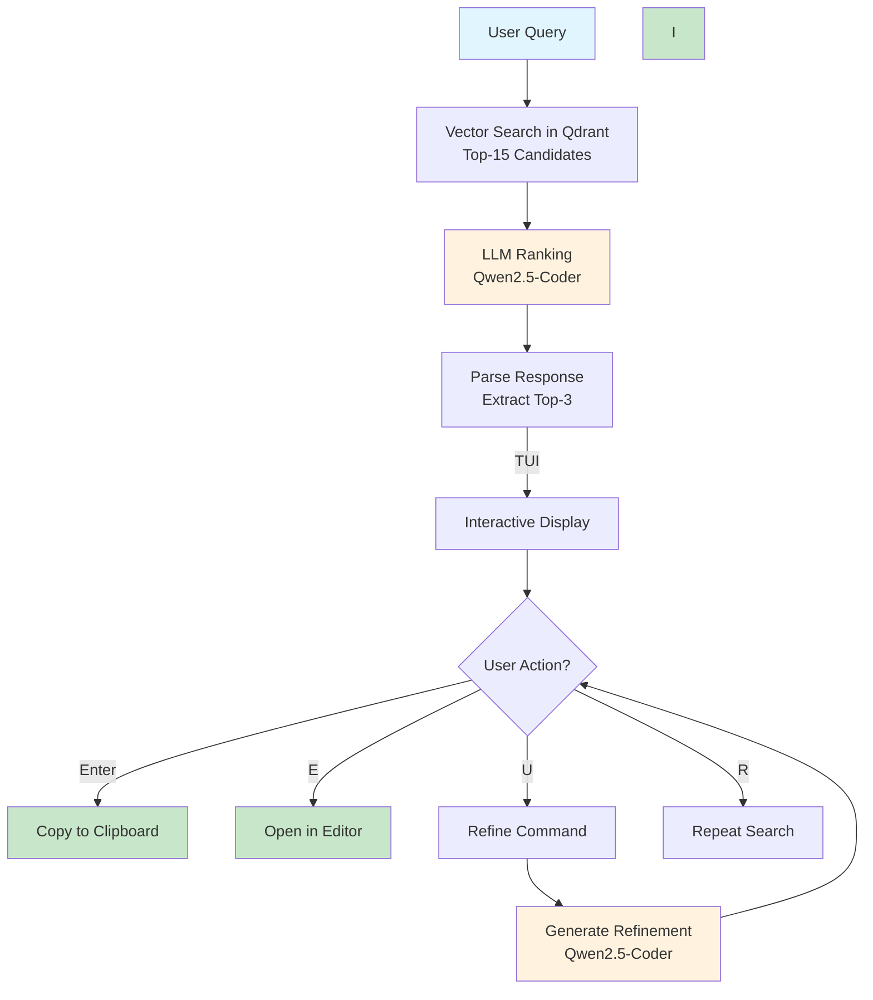

# Total Recall - ZSH Command RAG System

A prototype RAG (Retrieval-Augmented Generation) system for finding historical zsh commands based on natural language queries.

## System Architecture

### Core Components
- **Vector Database**: Qdrant (local Docker container on port 6334)
- **LLM & Embeddings**: Ollama (dengcao/Qwen3-Embedding-4B:Q5_K_M, qwen2.5-coder:14b)
- **Language**: Go 1.25.1
- **Interface**: Single binary with TUI app

## Prerequisites

1. **Docker** - for running Qdrant
2. **Ollama** - for embeddings and text generation
3. **Go 1.25.1+** - for building the binaries

## Setup

### 1. Start Qdrant
```bash
docker compose up -d
```

### 2. Setup Ollama Models
These two fit in 16GB of my RTX 4080 and produce decent results.
```bash
ollama pull dengcao/Qwen3-Embedding-4B:Q5_K_M
ollama pull qwen2.5-coder:14b
```

### 3. Build Binary
```bash
go build -o ./bin/recall ./cmd/main.go
```

## Workflow Diagrams

### Data Ingestion Workflow



### Query & Recall Workflow



## Usage

### Data Ingestion
```bash
# Ingest from default zsh history file
./recall -ingest

# Ingest from specific history file
./recall -ingest -history-file /path/to/.zsh_history
```

### Query Commands
```bash
# CLI mode - simple output
./recall "deploy kubernetes pod with redis:7"
```

## Configuration

All configuration is hardcoded in `internal/config/config.go`:
- Qdrant: `http://localhost:6333`
- Ollama: `http://localhost:11434`
- Vector dimensions: 768 (nomic-embed-text)
- Top-K candidates: 15
- Final results: 3

## Troubleshooting

**Qdrant not accessible**: Ensure Docker container is running with `docker compose ps`

**Ollama models not found**: Pull models with `ollama pull <model-name>`

**No results returned**: Check if ingestion completed successfully and Qdrant contains data

**LLM ranking fails**: The system will abort gracefully - ensure llama3.1:8b is available in Ollama
