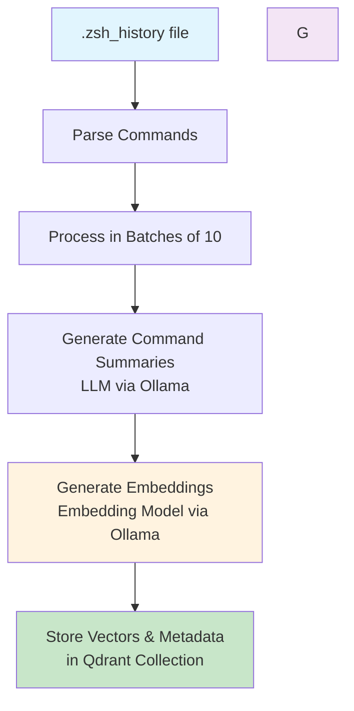
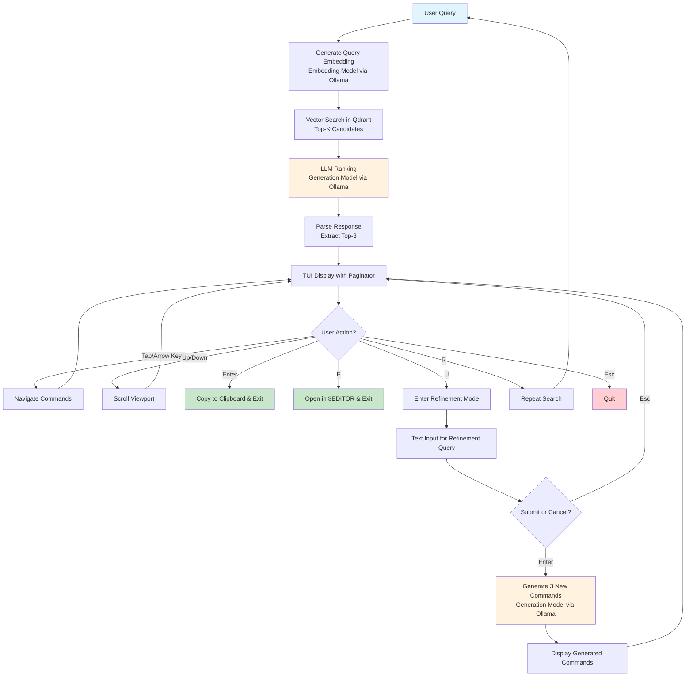

# Total Recall - ZSH Command RAG System

A prototype RAG (Retrieval-Augmented Generation) system for finding historical zsh commands based on natural language queries.

## System Architecture

### Core Components
- **Vector Database**: Qdrant (local Docker container on port 6334)
- **Embeddings**: Ollama (dengcao/Qwen3-Embedding-0.6B:F16 - 1024 dimensions)
- **Text Generation**: Ollama (qwen3:latest)
- **Language**: Go 1.25.1
- **Interface**: Single binary with TUI (Bubble Tea framework)
- **CLI**: Single recall binary handles both ingestion and query

## Prerequisites

1. **Docker** - for running Qdrant
2. **Ollama** - for embeddings and text generation
3. **Go 1.25.1+** - for building the binaries

## Setup

### 1. Start Qdrant
```bash
docker compose up -d
```

### 2. Setup Ollama Models
Default configuration uses:
```bash
ollama pull dengcao/Qwen3-Embedding-0.6B:F16
ollama pull qwen3:latest
```

Alternative configuration (better quality, more VRAM):
```bash
ollama pull dengcao/Qwen3-Embedding-4B:Q5_K_M
ollama pull qwen2.5-coder:14b
```

### 3. Build Binary
```bash
go build -o ./bin/recall ./cmd/main.go
```

## Workflow Diagrams

### Data Ingestion Workflow



### Query & Recall Workflow



## Usage

### Data Ingestion
```bash
# Ingest from default zsh history file
./recall -ingest

# Ingest from specific history file
./recall -ingest -history-file /path/to/.zsh_history
```

### Query Commands
```bash
# CLI mode - simple output
./recall "deploy kubernetes pod with redis:7"
```

## Configuration

Configuration is loaded from `~/.config/total-recall/config.yaml` with defaults in `internal/config/config.go`:

### Default Values
- **Qdrant**: `localhost:6334`
- **Ollama**: `http://192.168.0.10:11434`
- **Embedding Model**: `dengcao/Qwen3-Embedding-0.6B:F16`
- **Generation Model**: `qwen3:latest`
- **Vector dimensions**: 1024
- **Top-K candidates**: 15
- **Final results**: 3

### Customizable Prompt Templates
- Summary Prompt: `~/.config/total-recall/summary_prompt.tmpl`
- Ranking Prompt: `~/.config/total-recall/ranking_prompt.tmpl`
- Refinement Prompt: `~/.config/total-recall/refinement_prompt.tmpl`

Templates fallback to built-in defaults if files don't exist.

## Troubleshooting

**Qdrant not accessible**: Ensure Docker container is running with `docker compose ps`

**Ollama models not found**: Pull models with `ollama pull <model-name>`

**No results returned**: Check if ingestion completed successfully and Qdrant contains data

**LLM ranking fails**: The system will abort gracefully - ensure llama3.1:8b is available in Ollama
